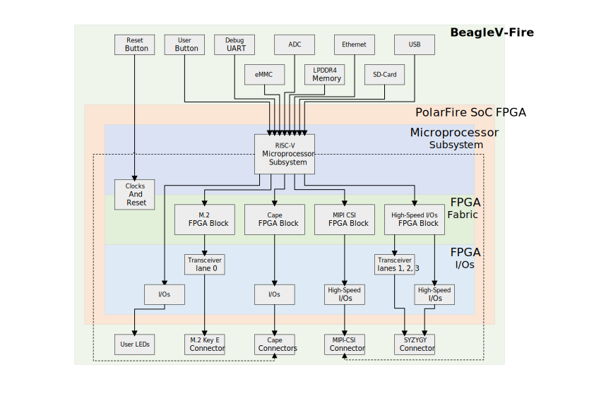
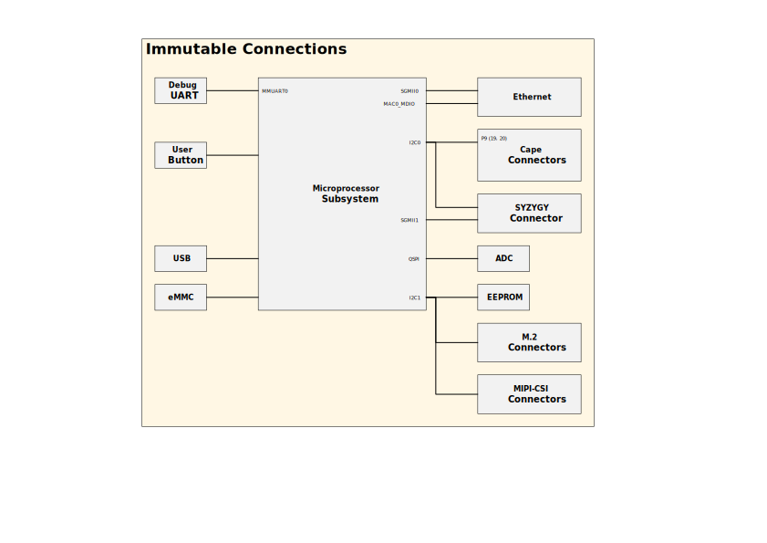

# Gateware Design Overview

## BeagleV-Fire Overview

Part of the gateware design is not flexible, mainly due to physical connections of dedicated PolarFire SoC I/Os. These parts of the design are concentrated within the base core gateware design [TODO: nomenclature].

