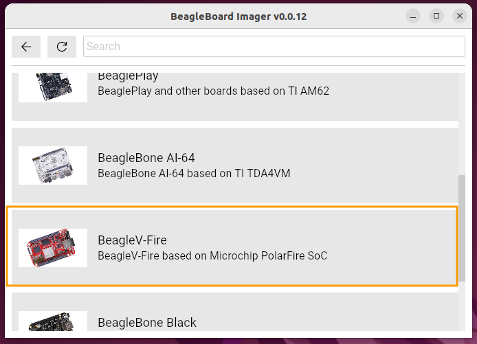
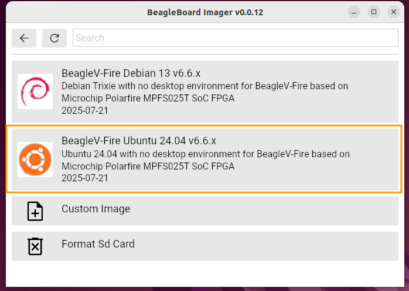
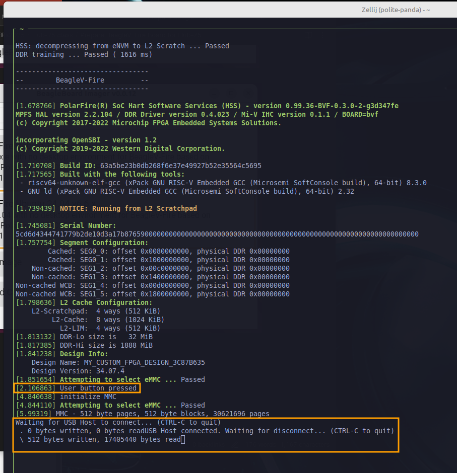
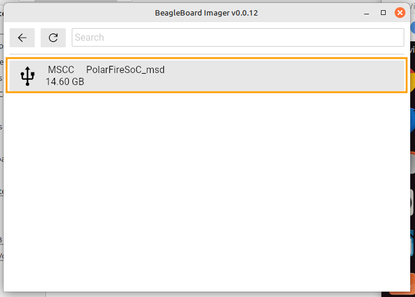
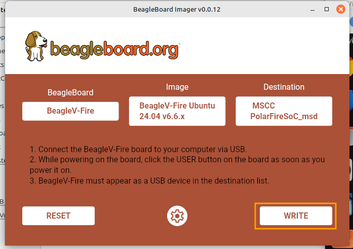

# Prepare BeagleV-Fire Board for Hub-75

This document provides step-by-step instructions to prepare a newly purchased BeagleV-Fire board for use in the Hub-75 LED Cube design.  Ubuntu 22.04 was used as the host OS.

## Overview
The process involves several major tasks as detailed below:
- Update the board to Ubuntu 24.04
- Update the kernel to include the simple-frame buffer driver
- Update the gateware to include the Hub-75 peripheral
## Update to Ubuntu 24.04
The BeagleV-Fire board currently ships with Ubuntu 23.04 which went End of Life on January 25, 2024.  

Ubuntu Releases page for more dates and information:
https://wiki.ubuntu.com/Releases

In order to update the board, a whole image replacement is necessary.  The easiest method uses the Beagle Board Imaging Utility while the board is connected via USB as a Mass Storage Device.

Link to Beagle Board Imaging Utility:
https://www.beagleboard.org/bb-imager


After downloading the correct architecture version for Ubuntu/Debian, perform the following commands:

```
cd ~/Downloads
sudo dpkg -i bb-imager-gui_0.0.12_amd64.deb
```

### Select BeagleV-Fire Board



### Select BeagleV-Fire Ubuntu 24.04

### Place BeagleV-Fire board into USB Mass Storage mode
To mount the BeagleV-Fire as a USB drive, the following sequence is used:
- If the board is powered and booted, press the Reset button to restart the boot sequence
- Press and hold the USER button.  
- After a couple of seconds, release the USER button
- The board should connect and enumerate to the computer as a USB Mass Storage device.

If the BeagleV-Fire is connected to a computer during the sequence above, using a terminal window (mini-term, screen, etc) will show the following:



> [!NOTE]
> Holding the USER button will pause the boot sequence until the USER button is released.  The key time to press the USER button is during the DDR training sequence which is the first item during the boot process.
>
### Select BeagleV-Fire as the destination



### Click Write to start the imaging


### Select No for custom settings

### Press the RESET button when imaging is completed


