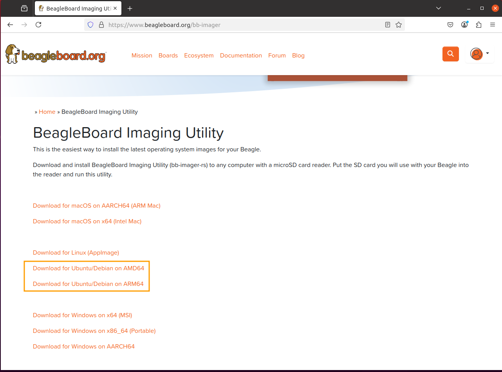
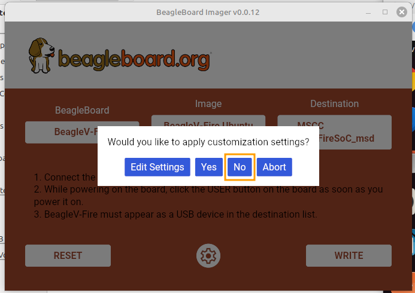

# Prepare BeagleV-Fire Board for Hub-75

This document provides step-by-step instructions to prepare a newly purchased BeagleV-Fire board for use in the Hub-75 LED Cube design.  Ubuntu 22.04 was used as the host OS.

Clone this repo into a directory in the home directory, like Projects or similar.

```
git clone https://github.com/jharoian-mchp/hub-75.git
```


## Overview
The process involves several major tasks as detailed below:
- Update the board to Ubuntu 24.04
- Update the kernel to include the simple-frame buffer driver
- Update the gateware to include the Hub-75 peripheral
## Update to Ubuntu 24.04
The BeagleV-Fire board currently ships with Ubuntu 23.04 which went End of Life on January 25, 2024.  

Ubuntu Releases page for more dates and information:
https://wiki.ubuntu.com/Releases

In order to update the board, a whole image replacement is necessary.  The easiest method uses the Beagle Board Imaging Utility while the board is connected via USB as a Mass Storage Device.

Link to Beagle Board Imaging Utility:
https://www.beagleboard.org/bb-imager


After downloading the correct architecture version for Ubuntu/Debian, perform the following commands:

```
cd ~/Downloads
sudo dpkg -i bb-imager-gui_0.0.12_amd64.deb
```

### Select BeagleV-Fire Board


### Select BeagleV-Fire Ubuntu 24.04

### Place BeagleV-Fire board into USB Mass Storage mode
To mount the BeagleV-Fire as a USB drive, the following sequence is used:
- If the board is powered and booted, press the Reset button to restart the boot sequence
- Press and hold the USER button.  
- After a couple of seconds, release the USER button
- The board should connect and enumerate to the computer as a USB Mass Storage device.

If the BeagleV-Fire is connected to a computer during the sequence above, using a terminal window (mini-term, screen, etc) will show the following:


> [!NOTE]
> Holding the USER button will pause the boot sequence until the USER button is released.  The key time to press the USER button is during the DDR training sequence which is the first item during the boot process.
>
### Select BeagleV-Fire as the destination


### Click Write to start the imaging


### Select No for custom settings

### Press the RESET button when imaging is completed


## Update the Kernel to enable the simple frame-buffer

Both of the remaining tasks are needed to use the Hub-75 peripheral from Linux.  This first step enables the simple-framebuffer as the Linux driver used to communicate with the Hub-75 peripheral.  The Hub-75 peripherals uses a chunk of memory to received the pixel contents for the LED panels.  The simple-framebuffer in conjunction with Hub-75's description in device-tree connects them.

The frame-buffer driver is not normally a module or built-in driver for Linux, so a custom configured version of the kernel needs to be compiled and moved to the target.

The correct version of the kernel is in place if a directory listing of the /dev/ directory shows a /dev/fb0 device.   A newly imaged device will not:


### Setup RISC-V Cross Compiler

Install RISC-V cross compiler and kernel dependencies via apt:

```
sudo apt install build-essential git gcc-riscv64-linux-gnu bc binutils bison \
				 dwarves flex  make openssl perl-base libssl-dev libelf-dev \
				 libncurses5-dev libncursesw5-dev ncurses-dev
```

### Get Kernel sources

Clone the kernel from linux4microchip repo as it contains the kernel that is already in the Ubuntu 24.04 image.  In this case, the tag is **linux4microchip+fpga-2025.03**.

```
git clone https://github.com/linux4microchip/linux.git
cd linux
git checkout tags/linux4microchip+fpga-2025.03 -b l4m-2025.03
```

Set up environment and copy configuration from Hub-75 repo:

```
export CROSS_COMPILE=riscv64-linux-gnu-
export ARCH=riscv
cp ../hub-75/helpers\ and\ artifacts/ubuntu.config .config
make menuconfig
```

### Configure the Kernel

Select Device Drivers/Graphics support/Frame buffer Devices.  Enable Support for frame buffer device drivers:


Enable Simple framebuffer support:


Ensure both are built-in (*) and **not** a module (M).  Exit and save new configuration.

### Build the Kernel

```
make -j4
```

### Make Image

