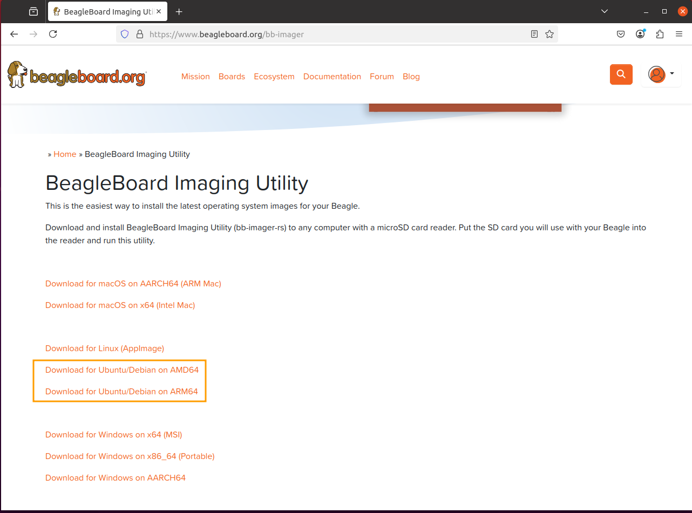
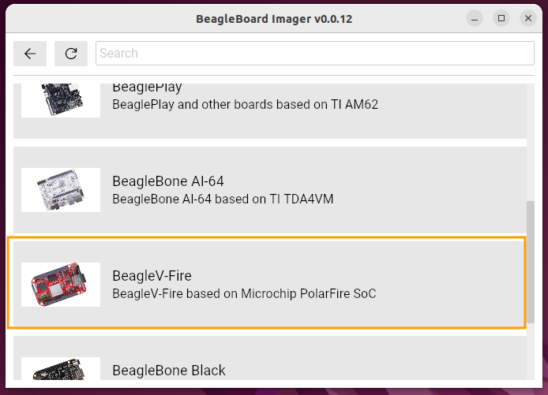
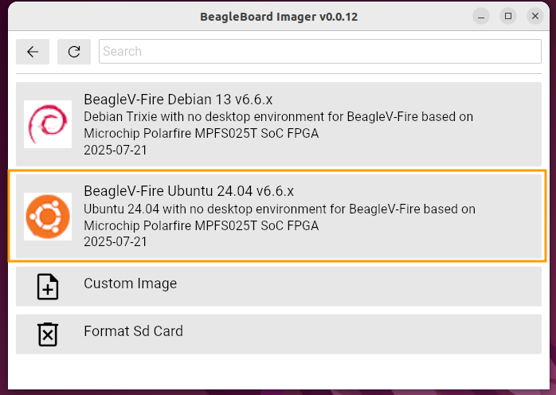
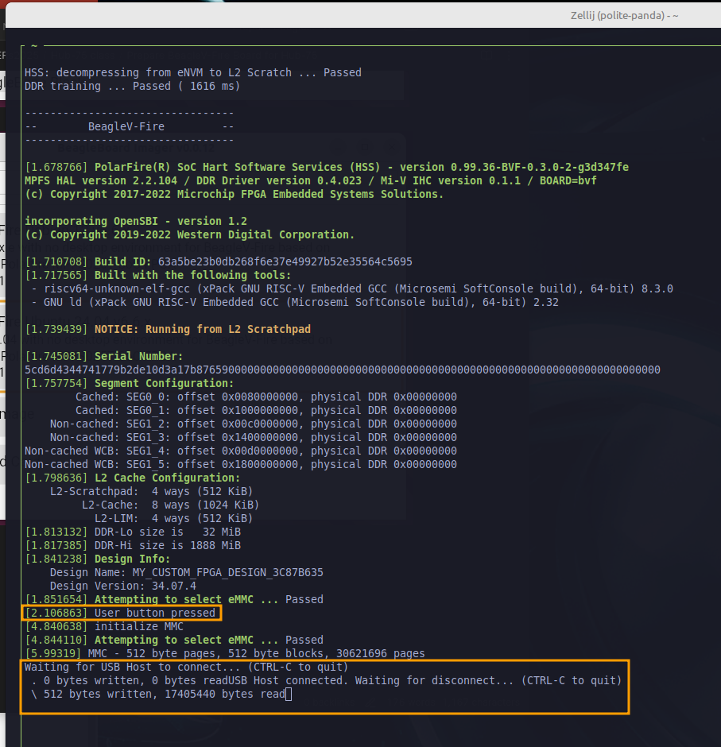
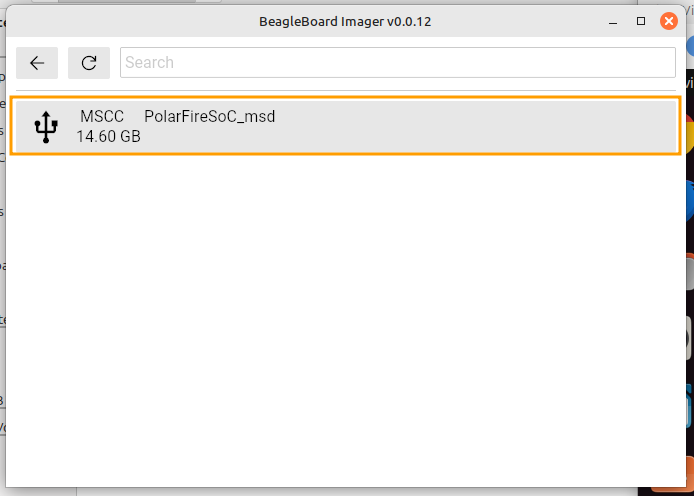
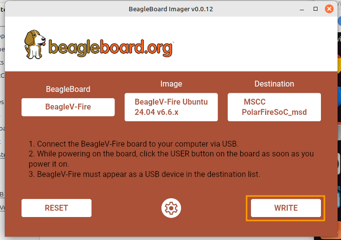
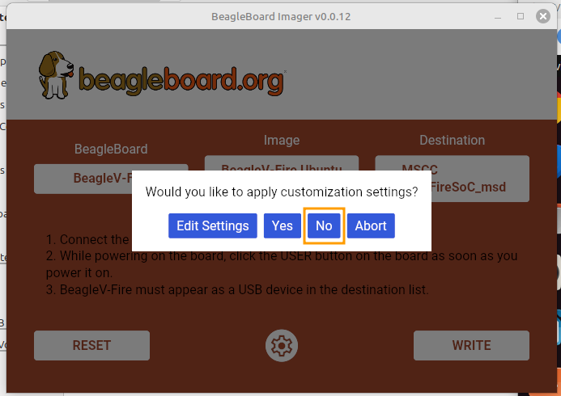
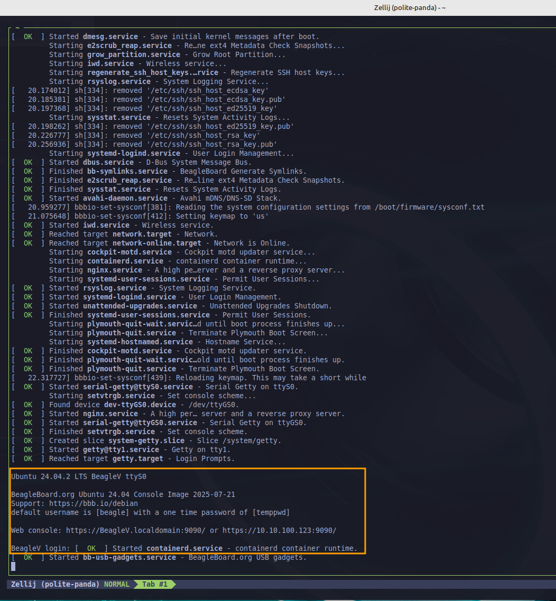

# Prepare BeagleV-Fire Board on Linux

This document provides step-by-step instructions to prepare a newly purchased BeagleV-Fire board for use in the Hub-75 LED Cube design.  Ubuntu 22.04 was used as the host OS.

Clone this repo into a directory in the home directory, like Projects or similar.

```
cd Projects
git clone https://github.com/jharoian-mchp/hub-75.git
```

## Overview
The process involves several major tasks as detailed below:
- Update the board to Ubuntu 24.04
- Update the kernel to include the simple-frame buffer driver
- Update the gateware to include the Hub-75 peripheral
- Load scripts and software for the BeagleV-Fire
## Update to Ubuntu 24.04
The BeagleV-Fire board currently ships with Ubuntu 23.04 which went End of Life on January 25, 2024.  

Ubuntu Releases page for more dates and information:
https://wiki.ubuntu.com/Releases

In order to update the board, a whole image replacement is necessary.  The easiest method uses the Beagle Board Imaging Utility while the board is connected via USB as a Mass Storage Device.

Link to Beagle Board Imaging Utility:
https://www.beagleboard.org/bb-imager


After downloading the correct architecture version for Ubuntu/Debian, perform the following commands:

```
cd ~/Downloads
sudo dpkg -i bb-imager-gui_0.0.12_amd64.deb
```

### Select BeagleV-Fire Board



### Select BeagleV-Fire Ubuntu 24.04

### Place BeagleV-Fire board into USB Mass Storage mode
To mount the BeagleV-Fire as a USB drive, the following sequence is used:
- If the board is powered and booted, press the Reset button to restart the boot sequence
- Press and hold the USER button.  
- After a couple of seconds, release the USER button
- The board should connect and enumerate to the computer as a USB Mass Storage device.

If the BeagleV-Fire is connected to a computer during the sequence above, using a terminal window (mini-term, screen, etc) will show the following:



> [!NOTE]
> Holding the USER button will pause the boot sequence until the USER button is released.  The key time to press the USER button is during the DDR training sequence which is the first item during the boot process.
>
### Select BeagleV-Fire as the destination



### Click Write to start the imaging


### Select No for custom settings

### Press the RESET button when imaging is completed

The board will come up and after the login prompt appears, it will continue to configure itself and reboot.  Wait for the reboot to complete prior to continuing to the next step.



## Update the Kernel to enable the simple frame-buffer

Both of the remaining tasks are needed to use the Hub-75 peripheral from Linux.  This first step enables the simple-framebuffer as the Linux driver used to communicate with the Hub-75 peripheral.  The Hub-75 peripherals uses a chunk of memory to received the pixel contents for the LED panels.  The simple-framebuffer in conjunction with Hub-75's description in device-tree connects them.

The frame-buffer driver is not normally a module or built-in driver for Linux, so a custom configured version of the kernel needs to be compiled and moved to the target.

### Setup RISC-V Cross Compiler

Install RISC-V cross compiler and kernel dependencies via apt:

```
sudo apt install build-essential git gcc-riscv64-linux-gnu bc binutils bison \
				 dwarves flex  make openssl perl-base libssl-dev libelf-dev \
				 libncurses5-dev libncursesw5-dev ncurses-dev u-boot-tools \
				 cpio
```

### Get Kernel sources

Clone the kernel from linux4microchip repo as it contains the kernel that is already in the Ubuntu 24.04 image.  In this case, the tag is **linux4microchip+fpga-2025.03**.

```
git clone https://github.com/linux4microchip/linux.git
cd linux
git checkout tags/linux4microchip+fpga-2025.03 -b l4m-2025.03
```

Set up environment and copy configuration from Hub-75 repo:

```
export CROSS_COMPILE=riscv64-linux-gnu-
export ARCH=riscv
cp ../hub-75/artifacts/ubuntu.config .config
make menuconfig
```

### Configure the Kernel

Select Device Drivers/Graphics support/Frame buffer Devices.  Enable Support for frame buffer device drivers:


Enable Simple framebuffer support:


Ensure both are built-in (*) and **not** a module (M).  Exit and save new configuration.

### Build the Kernel

```
make -j4
```

### Make Image

While in the linux directory, copy the kernel build artifact into the hub-75 "artifacts" directory to make the final image for the BeagleV-Fire

```
cp arch/riscv/boot/Image* ../hub-75/artifacts/
cd ../hub-75/artifacts/
mkimage -f beaglev_fire.its beaglev_fire.itb
```

Output from mkimage:

```
FIT description: U-Boot fitImage for the BeagleV-Fire
Created:         Mon Jul 28 15:58:12 2025
 Image 0 (kernel)
  Description:  Linux kernel
  Created:      Mon Jul 28 15:58:12 2025
  Type:         Kernel Image
  Compression:  gzip compressed
  Data Size:    9494340 Bytes = 9271.82 KiB = 9.05 MiB
  Architecture: RISC-V
  OS:           Linux
  Load Address: 0x80200000
  Entry Point:  0x80200000
  Hash algo:    sha256
  Hash value:   35fe5d48da361c715c9581d49d9e1bbc49a375ab5285acc059df8c97a5d80452
 Image 1 (base_fdt)
  Description:  Flattened Device Tree blob
  Created:      Mon Jul 28 15:58:12 2025
  Type:         Flat Device Tree
  Compression:  uncompressed
  Data Size:    24063 Bytes = 23.50 KiB = 0.02 MiB
  Architecture: RISC-V
  Load Address: 0x8a000000
  Hash algo:    sha256
  Hash value:   5e184e12ffbbadeeec56f55c4defcae040f1200496b5043fcd44ba6479029c7d
 Default Configuration: 'kernel_dtb'
 Configuration 0 (kernel_dtb)
  Description:  1 Linux kernel, FDT blob
  Kernel:       kernel
  FDT:          base_fdt
 Configuration 1 (base_dtb)
  Description:  Base FDT blob for BeagleV-Fire board
  Kernel:       unavailable
  FDT:          base_fdt

```

### Copy new Kernel to BeagleV-Fire

Mount the BeagleV-Fire as a USB drive again.  When mounted, there will be two drives.  One will contain the current beaglev_fire.itb (1D5C_EFDA) and the other is the root file system.

In the boot partition, rename beaglev_fire.itb to a new name like beaglev_fire_orig.itb.  If something goes wrong, the board can be mounted and the original file can be put back (renamed again) and the board will boot without having to reimage the whole eMMC.

Copy the new beaglev_fire.itb to the board, eject the drives, and reboot.

## Update gateware on BeagleV-Fire

Move back into the hub-75 directory

```
cd ..
pwd
/home/c14029/Projects/hub-75
```

In order to build the Hub-75 gateware, Libero 2024.2 needs to be installed and licensed.  Instructions located here:

https://ww1.microchip.com/downloads/aemDocuments/documents/FPGA/swdocs/libero/Libero_Installation_Licensing_Setup_User_Guide_2024_2.pdf

Additionally, a python virtual environment should be setup:

```
cd ~/Projects
python3 -m venv .beaglev-fire
source .beaglev-fire/bin/activate
pip3 install GitPython PyYAML requests
cd hub-75
```

Once completed then source the script to setup the environment.  Please edit to ensure that the paths are correct for the tools and license file:

```
source artifacts/setup-microchip-tools.sh
```

Start gateware build:

```
python3 build-bitstream.py custom-fpga-design/my_custom_fpga_design.yaml
```

Secure copy the resulting bitstream directory to the target:

```
scp -r bitstream/ beagle@<IP address>:/home/beagle
```

On the target, execute the following:

```
sudo /usr/share/beagleboard/gateware/change-gateware.sh bitstream/
```

The above command will load the gateware into the SPI flash and then reboot the board.

The BeagleV-Fire is now ready to drive the LED panels with the Hub-75 peripheral.

## Load scripts and software on BeagleV-Fire

```
scp -r software/ artifacts/target-scripts/ beagle@<IP address>:/home/beagle
```

On the BeagleV-Fire, execute the following commands:

```
cd /home/beagle/target-scripts/
source prep-client-software.sh
cd software
make
sudo make install
```

## Notes

Included in the Hub-75 repo is a pre-made kernel and bitstream folder.  Both are located in the hub-75/artifacts/target-ready-files folder
